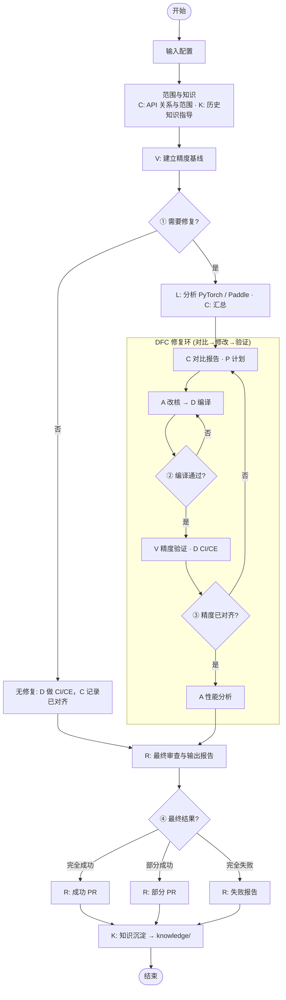
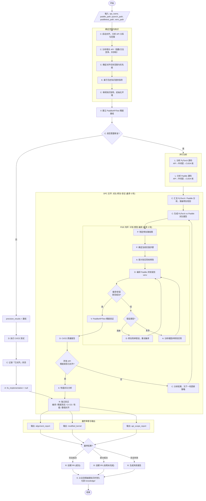

# Precision Alignment Agent 流程图

根据 [precision-alignment.prose](https://github.com/zrr1999/precision-alignment-agent/blob/main/precision-alignment.prose) 整理的 Paddle 与 PyTorch 精度对齐多智能体系统流程图。

## 简化流程（关键分支）

只保留主要决策点，细节合并为阶段框。



**四个关键分支：** ① 需要修复？ ② 编译通过？（FGE 内环） ③ 精度已对齐？（DFC 主环） ④ 最终结果？（完全 / 部分 / 失败）

---

## 参与智能体

| 代号  | 名称                 | 职责概要                                       |
| ----- | -------------------- | ---------------------------------------------- |
| **C** | Coordinator 协调者   | 分析 API 关系、确定范围、对比报告、策略决策    |
| **L** | Locator 定位者       | 代码路径分析、伪代码、精度关键点标注           |
| **V** | Validator 验证者     | PaddleAPITest 精度测试、基线建立、错误模式分析 |
| **D** | Diagnostician 诊断者 | 编译/安装、CI/CE 测试、故障排查                |
| **P** | Planner 规划者       | 修复路线图、优先级、依赖与回退                 |
| **A** | Aligner 对齐者       | CUDA 核修改、数值实现、性能与兼容              |
| **R** | Reviewer 审查者      | 独立验证、PR 生成、失败报告                    |
| **K** | Curator 策展者       | 任务前知识指导、任务后知识沉淀与持久化         |

## 主流程（完整）

```py
x = 1
```



## DFC 主环与 FGE 内环

- **DFC（Compare–Fix–Validate）**：在「需要修复」分支内，最多 3 轮；每轮包含：对比报告 → 修复计划 → FGE 内环（实现并编译通过）→ 精度验证 → 质量报告；若未对齐则由 C 更新策略进入下一轮。
- **FGE（Plan–Modify–Compile）**：在每轮 DFC 内，最多 5 轮；每轮：P 确定步骤 → A 修改实现 → D 编译安装；失败则按简单/复杂分别由 D 或 A 处理后再重试编译。

## PR 与知识沉淀

- **PR**：由 R 根据「完全成功 / 部分成功 / 完全失败」选择：成功/部分 PR，或失败报告；PR 标题形如 `[PAA][Precision Depth Alignment] {title}`，描述需覆盖涉及的 API/核/公共函数及 CI·CE、PaddleAPITest 结果。
- **知识沉淀**：由 K 在 PR 阶段之后执行，汇总 L、V、C、D、P、A、R 的上下文与报告，抽取可复用模式与最佳实践，持久化到 `knowledge/`，供后续任务检索。
